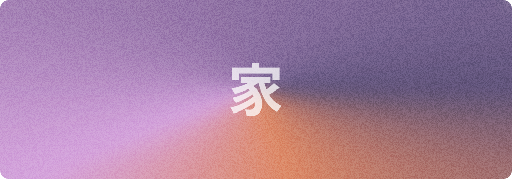

<p align="center">
  
</p>

<p align="center">
  ✨ Perconal portfolio website written with Vue 3 Composition API + Vuetify 3 using Material You Guidelines ✨
<p>

<p align="center">
  <a href="https://argente.vercel.app"><strong>⚡ Browse &rarr;</strong></a>
</p>

<p align="center">
  <a href="https://github.com/Jeffrey01596/argente-icons">
    
  </a>
  <a href="https://github.com/Jeffrey01596/argente-icons/blob/main/LICENSE">
    
  </a>
</p>

## Project startup
```
npm install
```

### Compiles and hot-reloads for development
```
npm run serve
```

### Compiles and minifies for production
```
npm run build
```

### Fix lint issues + Reformat code with Prettier
```
npm run lin:fix
```

## License

    Copyright 2022 Jeffrey Turns

    Licensed under the Apache License, Version 2.0 (the "License");
    you may not use this file except in compliance with the License.
    You may obtain a copy of the License at

    http://www.apache.org/licenses/LICENSE-2.0

    Unless required by applicable law or agreed to in writing, software
    distributed under the License is distributed on an "AS IS" BASIS,
    WITHOUT WARRANTIES OR CONDITIONS OF ANY KIND, either express or implied.
    See the License for the specific language governing permissions and
    limitations under the License.
